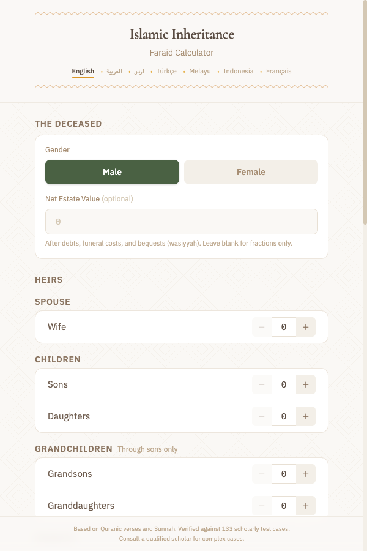

# Islamic Inheritance Calculator

A web app that calculates Islamic inheritance shares (faraid) based on Quranic verses and Sunnah. Enter who the deceased left behind, and it tells you exactly how the estate is divided.



## How it works

1. Select the deceased's gender
2. Enter which heirs are alive (spouse, children, parents, siblings, etc.)
3. Optionally enter the estate value
4. Get the exact fractional shares for each heir, with explanations

The form dynamically hides irrelevant fields. If the deceased has sons, you won't be asked about grandsons (they're blocked). If there's a father, siblings are hidden (Hanafi school). Only the minimum necessary questions are shown.

## What it handles

- All 22 heir types in Islamic inheritance law
- Blocking rules (hajb) - who excludes whom
- Awl (proportional reduction when shares exceed the estate)
- Radd (redistribution when shares don't fill the estate)
- Umariyyah, Mushtaraka, and Akdariyyah special cases
- Grandfather-with-siblings scenarios
- 7 languages: English, Arabic, Urdu, Turkish, Malay, Indonesian, French

## Correctness

Verified against **133 test cases** from [ilmsummit.org](http://inheritance.ilmsummit.org), a widely-referenced scholarly resource. All pass.

The test cases were scraped using `scripts/fetch-test-cases.py`, which fetches each case from ilmsummit.org and extracts the expected shares and calculation steps. The scraped data lives in `test-cases.json` and drives the test suite.

```bash
# Re-fetch test cases from ilmsummit.org
python3 scripts/fetch-test-cases.py

# Run the test suite
npm test
```

## Tech stack

- Next.js, TypeScript, Tailwind CSS
- [fraction.js](https://github.com/rawify/Fraction.js) for exact rational arithmetic (no floating-point rounding)
- Client-side only - no server, no database

## Running locally

```bash
npm install
npm run dev
```

## Live

https://inheritance-calc.whhite.com
